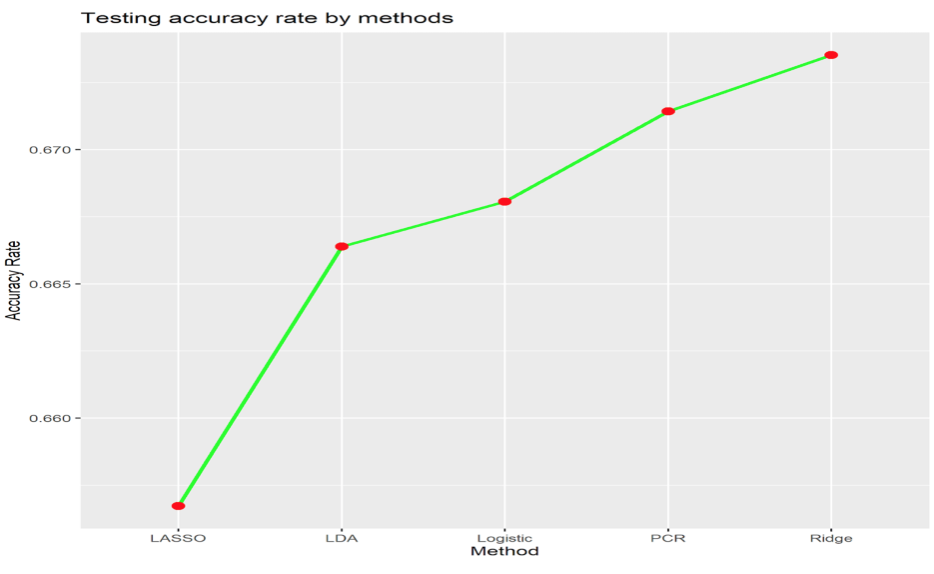
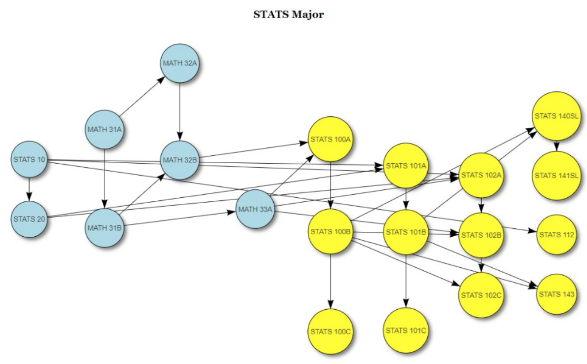

# Data Analysis Portfolio - 박기현(Ki Hyun Park) 
***
# [Project 1: 미국 프로농구 경기 승리 팀 예측(Kaggle Competition)](https://github.com/Ki-Hyun-Park/Kaggle_Competition)

- Background
     

     - 미국 내 모든 프로 농구팀을 팀 이름을 제외한 홈팀과 방문팀으로 설정했을때 (2000 - 2012)년 동안의 농구팀별 기록 데이터를 활용한 (2013 - 2014)년도 결과 예측  
     - 작업 인원수: 3명  
     - 작업 기간: 3주 

     
- Summary
     
(1). 데이터 수집  
     - 수집대상 : NBA 경기기록  
     - 수집 출처 : Kaggle 

     
(2). 데이터 전처리  
     - PCR을위한 반응 변수값 변환 (0 = 방문팀 승리 / 1 = 홈팀 승리).  
     - R의 is.na()를 통한 NA값 검토  
     - 상자그림을 활용한 이상치 데이터 검토  
     - 상관계수 행렬과 R의 dplyr 패키지를 통한 변수들의 예측 영향력 검토 및 해당 변수 추출 

     
(3). 데이터 모델링  
     - 과적합을 피하기위한 기존 훈련 데이터 변환("75(훈련 데이터):25(테스트 데이터)" 비율)  
     - Lasso, LDA, Logistic, PCR, Ridge을 통한 모델링 및 결과 예측(Ridge가 가장낮은 RMSE 및 가장 높은 유사도 보유) 

 
     
(4). 사용한 분석 툴 및 패키지  
     - 툴 : R  
     - 패키지 : glmnet, dplyr, ggplot2, MASS, pls, lubridate, data.table 

     
     
(5). 피드백  
     - 모델링 및 예측 과정 자체에 관점을 두는것보다 데이터를 완벽히 분석하고 이해하는것이 더 정확한 예측 결과물을 만들수있다.  
     - PCR 및 Ridge는 다중공선성 문제점을 해결할수있고 이점은 더 높은 유사도의 예측 결과물을 만들수있다. 

     
*Kaggle Competition 보러가기: [Kaggle](https://www.kaggle.com/c/fall-2019-stats-101c)*
     

 
***

# [Project 2: Curricular Complexity Project](https://github.com/Ki-Hyun-Park/Curricular_Complexity_Project)

- Background
     

     - UCLA의 15개 전공을 대상으로 졸업까지 소요되는 수업 갯수 및 시간을 활용한 EDA 및 비교분석(“STEM 전공 vs Non-STEM 전공”)  
     - 작업 인원수: 5명  
     - 작업 기간: 약 3주 

 
- Summary
     
(1). 데이터 수집  
     - 수집대상 : UCLA (항공우주공학, 간호학, 언어 & 철학, 통계학, 정치학, 미술학, 대기과학 & 해양학, 컴퓨터공학, 세계예술문화, 경제학, 생물학, 수학, 음악, 러시어학, 디자인예술학)전공 부서  
     - 수집 방법 : 각 전공 부서 방문 / R을 통한 웹 스크래핑  
     - 수집 출처 : UCLA 

     
(2). 데이터 전처리  
     - EDA를위한 특정 변수 제작[Hours(졸업까지 소요되는 총 학점), Out class(선행수업 중 상급과목에 가장 많이 적용되는 갯수), In class(상급과목 중 가장 많은 선행수업을 요구하는 갯수),
       Longest path(학기마다 연속적으로 들어야하는 수업 횟수), Bottlenecks(필요 선행수업이 3개 이상 요구되는 수업 갯수), Avg TTD(평균적으로 졸업까지 소요되는 학기 갯수),
       Stem(Yes = STEM 전공, No = Non-STEM 전공)]  
     - 왜 course catalog의 zero를 없앤는지 jeremy에게 

     
(3). 데이터 시각화  
     - STEM 전공과 Non-STEM 전공으로 나눴을때 평균(Hours, In/Out class, Longest paths, Bottlenecks)의 차이점 - 시각화 방법: 막대그래프  
     - STEM 전공과 Non-STEM 전공 분야로 나눈뒤 다시 각 분야에서 전공별로 분류했을때 Avg TTD의 차이점 - 시각화 방법: 막대그래프  
     - 각 전공별 선행수업부터 마지막 상급과목까지의 구성을 보여주는 인터렉티브 네트워크 그래프 

 
     
(4). 사용한 분석 툴 및 패키지  
     - 툴 : R / Tableau  
     - 패키지 : readxl, dplyr, stringr, dagitty, ggdag, visNetwork, rvest, tibble 

     
     
(5). 인사이트  
     - Avg TTD를 제외한 모든 변수에서 STEM 전공이 Non-STEM 전공보다 높은 수업량 및 시간을 요구했고 그중에서도 Hours가 가장 큰 차이를 나타냈다.
 
     
     
(6). 피드백  
     - 대부분의 STEM 전공은 학기마다 연속적으로 들어야하는 선행과목 및 상급과목이 많고 특정된 학기에만 들을수있는 수업들이 많다. 수업 하나를 통과하지 못하면 1년을 기다려야 할수도 있기에 추가적인 변수로
       "수업 통과율" 변수를 적용했다면 더 정확한 분석을 할수 있었을 것이라고 생각한다. 
 
  
<li></li>
<li></li>

*** 

