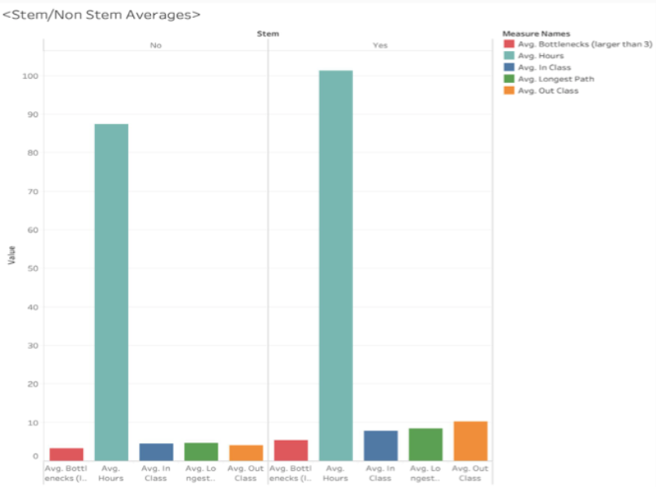

# Data Analysis Portfolio - 박기현 (Ki Hyun Park) 
***
# [Project 1: NBA 경기 승리 팀 예측 대회 (Kaggle Competition)](https://github.com/Ki-Hyun-Park/Kaggle_Competition)

- Background
     

     - 미국 내 모든 프로 농구팀을 팀 이름을 제외한 홈팀과 방문팀으로 설정했을 때 (2000 - 2012)년 동안의 농구팀별 기록 데이터를 활용한 (2013 - 2014)년도 결과 예측  
     - 작업 인원수 : 3명  
     - 작업 기간 : 3주 

     
- Summary
     
(1). 데이터 수집  
     - 수집대상 : NBA 경기기록  
     - 수집 출처 : Kaggle 

     
(2). 데이터 전처리  
     - PCA을 위한 반응 변수 값 변환 (0 = 방문팀 승리 / 1 = 홈팀 승리)  
     - R의 is.na()를 통한 NA값 검토  
     - 상자그림을 활용한 이상치 데이터 검토  
     - 상관계수 행렬과 R의 dplyr 패키지를 통한 변수들의 예측 영향력 검토 및 해당 변수 추출 

     
(3). 데이터 모델링  
     - 과적합을 피하기 위한 기존 훈련 데이터 변환 (75 (훈련 데이터) : 25 (테스트 데이터)) 비율  
     - Lasso, LDA, Logistic, PCA, Ridge를 통한 모델링 및 결과 예측 (가장 낮은 RMSE + 가장 높은 유사도 = Ridge) 

 
     
(4). 사용한 분석 툴 및 패키지  
     - 툴 : R  
     - 패키지 : glmnet, dplyr, ggplot2, MASS, pls, lubridate, data.table 

     
     
(5). 피드백  
     - 모델링 및 예측 과정 자체에 관점을 두는 것보다 데이터를 완벽히 분석하고 이해하는 것이 더 정확한 예측 결과물을 만들 수 있다.  
     - PCA 및 Ridge는 다중공선성 문제점을 해결할 수 있고 이점은 더 높은 유사도의 예측 결과물을 만들 수 있다. 

     
*Kaggle Competition 보러가기: [Kaggle](https://www.kaggle.com/c/fall-2019-stats-101c)*
     
    
 
***

# [Project 2: Curricular Complexity Project](https://github.com/Ki-Hyun-Park/Curricular_Complexity_Project)

- Background
     

     - UCLA의 15개 전공을 대상으로 졸업까지 소요되는 수업 관련 정보를 활용한 EDA 및 비교분석(“STEM 전공 vs Non-STEM 전공”)  
     - 작업 인원수 : 5명  
     - 작업 기간 : 약 3주 

 
- Summary
     
(1). 데이터 수집  
     - 수집대상 : UCLA (항공우주공학, 간호학, 언어 & 철학, 통계학, 정치학, 미술학, 대기과학 & 해양학, 컴퓨터공학, 세계예술문화, 경제학, 생물학, 수학, 음악, 러시어학, 디자인예술학) 전공 부서  
     - 수집 방법 : 각 전공 부서 방문 / R을 통한 웹 스크래핑  
     - 수집 출처 : UCLA 

     
(2). 데이터 전처리  
     - EDA 및 비교분석을 위한 특정 변수 제작 : Hours (졸업까지 소요되는 총 학점), Out class (선행수업 중 상급 과목에 가장 많이 적용되는 개수), In class (상급 과목 중 가장 많은 선행수업을 요구하는            개수), Longest path (학기마다 연속적으로 들어야 하는 수업 횟수), Bottlenecks (필요 선행수업이 3개 이상 요구되는 수업 개수), Avg TTD (평균적으로 졸업까지 소요되는 학기 개수),                      Stem (Yes = STEM 전공, No = Non-STEM 전공) 

     
(3). 데이터 시각화  
     - STEM 전공과 Non-STEM 전공으로 나눴을 때 평균 (Hours, In/Out class, Longest paths, Bottlenecks)의 차이점 (막대그래프)  
     - STEM 전공과 Non-STEM 전공 분야로 나눈 뒤 다시 각 분야에서 전공별로 분류했을 때 Avg TTD의 차이점 (막대그래프)  
     - 전공별 첫 선행수업부터 마지막 상급 과목까지의 구성 (인터렉티브 네트워크 그래프) 

 
     
(4). 사용한 분석 툴 및 패키지  
     - 툴 : R / Tableau  
     - 패키지 : readxl, dplyr, stringr, dagitty, ggdag, visNetwork, rvest, tibble 

     
     
(5). 인사이트  
     - Avg TTD를 제외한 모든 변수에서 STEM 전공이 Non-STEM 전공보다 높은 수업량 및 시간을 요구했고 그중에서도 Hours가 가장 큰 차이를 나타냈다.
 
     
     
(6). 피드백  
     - 대부분의 STEM 전공은 학기마다 연속적으로 들어야 하는 선행과목 및 상급 과목이 많고 특정된 학기에만 들을 수 있는 수업들이 많다. 수업 하나를 통과하지 못하면 1년을 기다려야 할 수도 있기에 추가적인 변수로
       "수업 통과율" 변수를 적용했다면 더 정확한 분석을 할 수 있었을 것으로 생각한다. 
 

*** 

# [Project 3: Blood Pressure Project](https://github.com/Ki-Hyun-Park/Blood_Pressure_Project)

- Background
     

     - The Islands(인터넷 가상 세계)에서 섬 주민들에게 특정 운동과 음식물이 혈압에 어떻게 영향을 미치는지 확인하는 2x2 요인설계 및 블록 (나이, 성별) 분석  
     - 작업 인원수 : 7명  
     - 작업 기간 : 약 2주 

     
- Summary
     
(1). 데이터 수집  
     - 수집대상 : The Islands에 거주하는 48명의 주민  
     - 수집 출처 : The Islands 

     
(2). 데이터 전처리  
     - 혈압 수치 : (운동 및 식품이 적용되기 전에 혈압 수치 - 적용 이후 혈압 수치)  
     - 운동량 : 달리지 않고 20분 동안 휴식 (Low Level), 5km 달리기 (High Level)  
     - 식품 섭취 : 올리브 오일 500mg을 함유한 알약 복용 (Low Level), 코카잎 500mg 복용 (High Level)  
     - 블록 (나이) 3 Levels : 16-35 (R에서 -1 값으로 변환), 36-55 (R에서 0 값으로 변환) , 56+ (R에서 1 값으로 변환)  
     - 블록 (성별) 2 Levels : 남자 (R에서 1 값으로 변환), 여자 (R에서 -1 값으로 변환) 

     
(3). 데이터 분석  
     - ANOVA (혈압 수치 ~ 운동량 x 식품 섭취)  
     - ANOVA (혈압 수치 ~ 운동량 x 식품 섭취 + 나이 + 성별)  
     - (혈압 수치 ~ 운동량 x 식품 섭취)의 다중비교 

     
     
(4). 데이터 시각화  
     - ANOVA (혈압 수치 ~ 운동량 x 식품 섭취)을 활용한 잔차 그림  
     - ANOVA (혈압 수치 ~ 운동량 x 식품 섭취 + 나이 + 성별)을 활용한 잔차 그림  
     - (혈압수치 ~ 운동량 x 식품 섭취)의 상호작용 그래프 

     
     
(5). 사용한 분석 툴 및 패키지  
     - 툴 : R  
     - 패키지 : tidyverse, pwr, sjstats, phia, kableExtra, knitcitations, bookdown 

     
     
(6). 인사이트  
     - "식품 섭취" 그리고 "운동량" 모두 개별적으로는 혈압 수치에 영향을 미치지 못했지만 두 가지의 상호작용 효과는 혈압 수치에 영향을 미치는 것으로 나타났다.  
     - 블록 (나이) 그리고 블록 (성별) 모두 (혈압 수치 ~ 운동량 x 식품 섭취)에 영향을 미치지 못했다. 

     
     
(7). 피드백      
     - The Islands에서 데이터를 수집하는데 소요되는 로딩 시간과 프로젝트를 마무리 하는 데까지 주어진 시간을 고려했을 때 48명의 데이터밖에 수집할 수 없었고 48명의 데이터는 너무 작았기에 편향이 있었을 것이라
       생각한다. 

     
*The Islands 보러가기: [The Islands](https://islands.smp.uq.edu.au/)*

